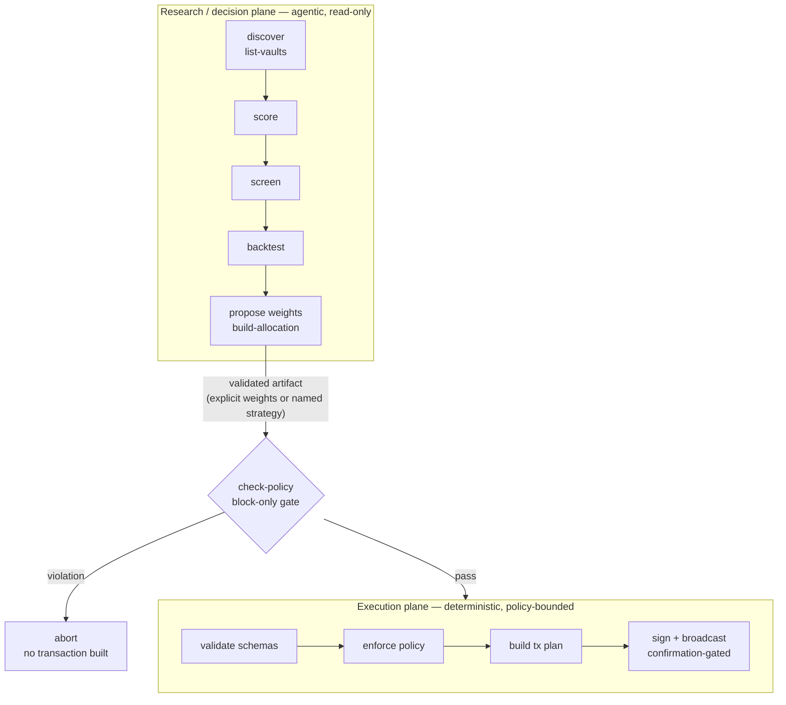
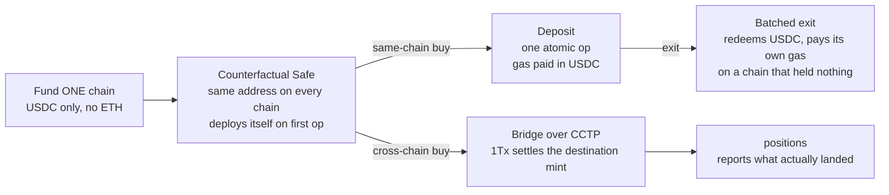

<div align="center">

# OpenAllocator

**A harness for AI agents to run policy-bounded DeFi yield allocation on the [1Tx](https://app.1tx.fi/) API — every step a JSON-out CLI command an agent can drive.**

[](LICENSE)
[](pyproject.toml)
[](#development)
[](#)

[The Mandate](#the-mandate) · [Install](#install) · [Talking to Your Agent](#talking-to-your-agent) · [Commands](#commands) · [Safety](#safety) · [Disclaimer](#disclaimer)


<sub>A plain-language ask → a policy-clean $10k book, the honest "this passed set is a Morpho-on-Base monoculture" finding, and a proposal artifact that signs nothing without your go-ahead. · ▶ **[Watch a full run](docs/media/demo-full-run.mp4)**</sub>

</div>

OpenAllocator is an open-source, agent-operated DeFi yield allocator built on the [1Tx](https://app.1tx.fi/) API and run as a CLI. It discovers the live 1Tx instrument universe, scores yield venues transparently, builds policy-bounded allocations, and executes through a self-custody wallet — only after explicit confirmation.

**One sentence in, a governed allocation out, with a reason attached to every knob.** You write what you want — *"different buckets, good yield, but enough diversification"* — and the agent derives a **mandate**: score-tiered sleeves with a declared share each, and a policy narrowed from your baseline to match. Every number it moved carries the measurement that justified it. Deterministic code then checks that the derived policy only ever *narrows* what you already allowed, before a single transaction is built.

**That is portfolio construction, not yield-chasing.** Most "auto-yield" tools sweep funds into whatever APY is highest this hour. OpenAllocator does what a professional asset allocator does — a declared risk budget, a measured floor under diversification, and an explicit policy that execution cannot widen — run through an agent instead of a desk. High APY is a risk input, never the objective.

**It does not pick your trade-off for you.** Independence and yield pull against each other, so the allocator exposes both controls and *measures* what your choice cost — per run, on the shelf as it stands that day. Want the top rates? That is a knob. Want the most independent book the shelf allows? Also a knob. See [docs/capabilities.md](docs/capabilities.md) for the full surface.

This is an end-user allocator, not Morpho's curator-side Allocator role.

> APY is descriptive, not predictive. Rates move, rewards end, liquidity changes, and smart-contract risk remains. Every metric here is yield-path only — never principal, depeg, bridge, or contract-loss risk.

---

## Why It Exists

- **A mandate you can read in thirty seconds** — a sentence of intent becomes score-tiered sleeves and a narrowed policy, with a `because` on every knob that moved. It is the artifact that makes the rest of this legible; see [The Mandate](#the-mandate).
- **Professional allocation, not APY-chasing** — risk/reward metrics and quality tiers, the way an allocator builds a book rather than a sweep to the top rate.
- **Diversification measured, not labelled** — a ceiling on a protocol or chain label can be satisfied by holding many names that are really one bet. So the policy also carries a *floor* on the effective number of independent positions, computed from the instruments' own history, and it fails closed when independence can't be measured.
- **Dynamic discovery** — no hardcoded protocol or chain universe; new networks and instruments are picked up automatically from 1Tx.
- **Transparent scoring** — every allocation and risk score maps to visible inputs. Unknown fields stay `Unknown` instead of being guessed.
- **Policy-bounded execution** — allowlists and caps block unsafe proposals before signing. Policy can only tighten, never loosen.
- **CLI-first** — agents and humans use the same JSON-out commands. Every command prints one JSON object to stdout.
- **Self-custody, and gasless** — the wallet signs and broadcasts its own transactions. With a Safe smart account it pays gas in **USDC** instead of native tokens, so you fund one chain and never top up ETH anywhere.

## The Mandate

A mandate is what you asked for, plus the knobs derived from it, plus the reason for each. It is the readable half of the allocator: [policy.yaml](policy.yaml) says what execution *may* do; the mandate says what was *asked for* and how that request was read.

```yaml
text: |
  I need a professional asset allocation with different buckets, good yield,
  but enough diversification.

strategy: sleeves
strategy_params:
  tiers:
    - {name: core,     min_score: 0.85, max_score: 1.01, weight: 0.50, min_positions: 5}
    - {name: yield,    min_score: 0.58, max_score: 0.85, weight: 0.35, min_positions: 6}
    - {name: frontier, min_score: 0.00, max_score: 0.58, weight: 0.15, min_positions: 12}

rationale:
  - knob: strategy_params.tiers[].min_score
    because: >
      Cut where the scores actually sit, not at the library defaults. The
      default ladder puts its bottom band under 0.30 and on this shelf that
      band is EMPTY, so a three-bucket mandate would have rendered as two...
```

**The rationale is the product, not documentation.** Each entry names the measurement that moved the knob — band populations, gap widths, the value that was tried and rejected — so a reader can audit the derivation instead of taking the numbers on trust. The worked example in [mandate.yaml](mandate.yaml) contradicts three values that looked reasonable until they were run against the live shelf, and says so.

Three things make it safe to let a model write this:

1. **A derived policy may only narrow.** `validate-mandate` rejects one that loosens *anything* against your baseline — ceilings down, floors up, allowlists to subsets, flags to their restricting value — and treats a dropped knob as a loosening, because `null` is permissive rather than neutral.
2. **The mandate is bound to its policy by hash.** Edit the derived policy and validation fails, so the rationale that argued for a number cannot drift away from the number.
3. **The agent writes files and never signs.** Derivation is a proposal; deterministic Python validates and executes.

```bash
uv run open-allocator validate-mandate --mandate mandate.yaml --baseline policy.yaml
uv run open-allocator drift --mandate mandate.yaml --positions positions.json
```

`drift` is the daily counterpart: it asks whether the book still matches the mandate, and if it does, nothing expensive runs. It never answers "no drift" because it could not tell — a check it cannot run says so and drift is true.

How an agent derives one is in [skills/mandate.md](src/open_allocator/skills/mandate.md).

## How It Works

The system has two planes:

- **Research / decision plane (agentic).** Agents and humans discover the universe, compare scored instruments, screen by risk, backtest, and propose weights — freely and read-only.
- **Execution plane (deterministic).** Python in `open_allocator.core` and `open_allocator.exec` validates schemas, enforces policy, builds transaction plans, and blocks unsafe execution. The executor never runs agent-authored code.

A decision leaves the research plane only as a **validated artifact** — explicit weights or a named+parameterized strategy — and must pass `check-policy` before any transaction is built.



## Install

Requires Python `>=3.12,<3.13` and [uv](https://docs.astral.sh/uv/).

```bash
uv sync
uv run open-allocator --help
```

## Configure

Create a 1Tx account and generate an API key at **[app.1tx.fi/settings](https://app.1tx.fi/settings)**, then copy [.env.example](.env.example) to `.env` and set:

| Variable | Purpose |
| --- | --- |
| `ONE_TX_API_URL`, `ONE_TX_API_KEY` | 1Tx API endpoint and key — create the key at [app.1tx.fi/settings](https://app.1tx.fi/settings). |
| `SIGNER_ACCOUNT` | `eoa` (default) or `safe` — what holds the funds. |
| `SIGNER_SUBMISSION` | `rpc` (default) or `erc4337-paymaster` — how the tx reaches the chain. |
| `SIGNER_OWNER` | `local` (default) or `remote` — where the signing key lives. |
| `ONE_TX_PRIVATE_KEY` | Funded EOA key; required only for a local-key EOA over RPC. |
| `RPC_URL_<chainId>` | Override the built-in public RPC for a chain (required for broadcast). |
| `ONE_TX_SLIPPAGE_BPS`, `ONE_TX_FAST_TRANSFER` | 1Tx transaction options. |


Governance lives in [policy.yaml](policy.yaml) — the allocator's constitution. It defines `allowed` axes (protocols, chains, `asset_categories`, `stablecoin_only`, assets, curators), `caps` (per-instrument / protocol / curator / chain weight, min TVL, max LLTV, max reward dependence), and `gates` (new-instrument approval, autonomous rebalance, max deploy per cycle). Allowlists are narrowing filters over discovery (`null` = all); they never replace discovery.

## Talking to Your Agent

OpenAllocator is a harness: you don't type CLI commands, your **agent** does. Point a coding agent (Claude Code, Cursor, or any agent that can run a shell) at this repo — it reads [AGENT_GUIDE.md](AGENT_GUIDE.md) and the [skills](#agent-operation) — and then you drive everything in plain language. The agent translates your intent into the JSON-out commands below, and every spend stays confirmation-gated.

**Set a mandate** (read-only)

> "I need a professional asset allocation with different buckets, good yield, but enough diversification. Derive me a mandate and show me why you picked each number."
>
> "Has my book drifted from that mandate since yesterday?"

**Discover & analyze** (read-only)

> "Show me the highest-scoring stablecoin venues 1Tx can see right now, and explain why the top three rank where they do."
>
> "Screen for anything with Sharpe above 1 and max drawdown under 10%, stablecoin-only, then build me a balanced $10k allocation."
>
> "Backtest that allocation against just holding USDC and show me the drawdown."

**Check policy & execute** (confirmation-gated)

> "Check this allocation against my policy — tell me exactly what would block before I sign anything."
>
> "Looks good — execute it, but first walk me through the wallet, chains, instruments, amounts, and gas."
>
> "Rebalance my current positions toward this target and show me the diff before broadcasting anything."
>
> "Withdraw position X and tell me what I'll receive, in shares."

The agent never signs or broadcasts without announcing the exact action and getting your confirmation (see [Safety](#safety)). The [Commands](#commands) below are what it runs under the hood — you can also run them directly.

## Commands

Every command emits one JSON object on stdout; errors emit one JSON object on stderr and exit non-zero.

**Discovery & read-only**

```bash
uv run open-allocator wallet-status                 # address, USDC + native-gas readiness per chain
uv run open-allocator safe-address                  # the derived Safe: same address on every chain
uv run open-allocator list-vaults --sort score      # discover + score the live universe
uv run open-allocator score-vault --instrument-id <id>
uv run open-allocator positions                     # reconcile current on-chain holdings
```

**Analysis & planning** (read-only)

```bash
uv run open-allocator screen --min-sharpe 1.0 --max-drawdown 0.1   # advisory risk narrowing
uv run open-allocator build-allocation --amount 10000 --risk balanced
uv run open-allocator simulate  --allocation allocation.json       # forward blended-APY / concentration
uv run open-allocator backtest  --allocation allocation.json       # daily-compounded NAV vs benchmark
uv run open-allocator check-policy --allocation allocation.json    # block-only policy gate
```

**Mandate** (read-only, and no model anywhere near either one)

```bash
uv run open-allocator validate-mandate --mandate mandate.yaml --baseline policy.yaml
uv run open-allocator drift --mandate mandate.yaml --positions positions.json \
    --allocation target.json --previous-shelf yesterday.json
```

`validate-mandate` reads files only — no discovery, no network — and runs four checks. It **reports through its `ok` field while still exiting 0**, same convention as `check-policy`, so read the field and not the exit code. `drift` reads the live shelf to score held instruments into sleeves and to spot listings that appeared or vanished; run it first each day, and if `drifted` is false, stop before anything expensive.

`build-allocation` supports risk presets, allocation strategies (`--strategy`, parameterized with repeatable `--strategy-param key=value`), advisory screening flags, `--exclude`, pinned weights (`--pin id=weight`), and a full [allocation-spec](src/open_allocator/schemas/allocation-spec.schema.json) via `--spec`.

### Choosing a construction rule

Two rules carry the story above, and they answer the two questions a mandate is usually made of:

| Ask | Strategy | Mechanism |
| --- | --- | --- |
| **A risk budget you declare** | **`sleeves` / `ladder`** | Score-tiered buckets, each with a target weight, a per-tier floor on names, and its own sub-strategy. **This is what a mandate derives into.** |
| **The most independent book** | **`decorrelated`** | Weight divided by measured correlation load; `top_n` adds greedy selection |

Also supported, for asks that are not a risk budget:

| Ask | Strategy | Mechanism |
| --- | --- | --- |
| Highest scored yield | `score_weighted` (the CLI default) | Composite score, tilted by `--apy-weight` / `--score-power` |
| No opinion | `equal_weight` | The honest baseline |
| Volatility-balanced | `risk_parity` / `inverse_vol` | Inverse APY volatility |
| A core plus bets | `core_satellite` | Core and satellite, each with its own selector |

`sleeves` tiers key on the **composite score** — a blend of nine measured factors (TVL, APY stability, reward dependence, liquidity, oracle, fee, curator, market concentration, collateral mix) — so a sleeve is a quality band computed from data, not a hand-applied label. Each tier declares its target share of the book, which is how you express "half in the top band, a fifth in the bottom".

`simulate` then reports what the choice actually bought: `effective_positions` (independent-bet count, inverse-HHI over the correlation matrix), `median_tail_lift` (how much more often held pairs have a bad day on the *same* day), `unmeasured_weight_bps` (how much of the book those metrics couldn't see), and `hidden_tail_pairs` (pairs correlation calls diversified that co-crash anyway). Compare two strategies by building both and diffing that output — the trade-off depends on the live shelf, so measure it, don't look it up.

Full knob surface, plus the known limits of each metric: **[docs/capabilities.md](docs/capabilities.md)**.

**Execution** (confirmation-gated)

```bash
uv run open-allocator build-tx  --allocation allocation.json       # calldata plan (dry run)
uv run open-allocator execute   --allocation allocation.json --confirm
uv run open-allocator rebalance --current positions.json --target allocation.json --confirm
uv run open-allocator withdraw  --position <id> --confirm
```

Without `--confirm`, execution commands return a plan / dry-run report and broadcast nothing. `execute --confirm` is the spend path. Exits are share-denominated (ERC-4626 shares, not USDC guesses).

## Gas in USDC (no native tokens)

Set `SIGNER_ACCOUNT=safe` and `SIGNER_SUBMISSION=erc4337-paymaster` and the allocator runs from a **Safe smart account that pays its own gas in USDC**:




- The Safe is **counterfactual** — derived from your owner list, the same address on every chain, and it deploys itself inside its first operation on each chain. Nothing to create up front.
- A chain's plan steps go out as **one atomic operation**. Because the paymaster charges after execution, an exit pays its gas out of the USDC it just redeemed — on a chain where the Safe held nothing at all.
- Cross-chain deposits bridge over CCTP without deploying anything on the destination.

Net effect: **fund one chain**. Deposits bridge out, exits pay their own way back, and no chain ever needs native gas.

A cross-chain buy has two legs with one owner each. The allocator signs, submits, and reports the **source-chain** leg — `execute` returns once that transaction lands. Relaying the CCTP message and minting on the far side is **1Tx's to settle**; the allocator does not poll the bridge by design. Read what actually landed with `positions`. An operation that has settled nothing — a bundler hasn't included the user-op, a Safe is awaiting signatures — reports `in_progress`, never `success`.

This path has been exercised end to end on Base and Arbitrum mainnet. The model, the traps, and its known limits are in [docs/gasless-execution.md](docs/gasless-execution.md).

## Agent Operation

Agents start with [AGENT_GUIDE.md](AGENT_GUIDE.md), the operating contract for this repository. Shared architecture and invariants are in [PROJECT_CONTEXT.md](PROJECT_CONTEXT.md).

Stage skills and workflow graphs describe how to drive the CLI and review artifacts:

- Skills: [mandate](src/open_allocator/skills/mandate.md), [discover](src/open_allocator/skills/discover.md), [score](src/open_allocator/skills/score.md), [build-allocation](src/open_allocator/skills/build-allocation.md), [agentic-allocation](src/open_allocator/skills/agentic-allocation.md), [execute-with-1tx](src/open_allocator/skills/execute-with-1tx.md), [rebalance](src/open_allocator/skills/rebalance.md), [withdraw](src/open_allocator/skills/withdraw.md), plus [risk-review](src/open_allocator/skills/meta/risk-review.md) and [checkpoint-protocol](src/open_allocator/skills/meta/checkpoint-protocol.md).
- Workflows: [allocate](src/open_allocator/workflows/allocate.yaml), [rebalance](src/open_allocator/workflows/rebalance.yaml), [withdraw](src/open_allocator/workflows/withdraw.yaml).
- Artifact schemas: [schemas/](src/open_allocator/schemas/).

## Safety

- Never sign, broadcast, rebalance, or withdraw without first announcing the exact action (wallet, chains, instruments, amounts, gas assets, policy result, failure modes) and obtaining confirmation.
- Policy violations abort before any transaction is built or signed. `--unsafe` / `--autonomous` are not shortcuts — use them only when policy and task explicitly require it.
- Keep private keys out of logs and artifacts.
- Treat high APY as a risk input, not a promise.

## Development

```bash
uv run ruff check
uv run pytest            # 723 passed, 3 integration tests skipped without live creds
```

Unit tests mock 1Tx over `httpx.MockTransport` and the chain over `eth-tester`; no live network is touched. Live API/RPC tests are opt-in behind `@pytest.mark.integration` and explicit credential gates.

Layout: `src/open_allocator/core` (allocation, scoring, policy, risk metrics, strategies, screening, backtest, positions, checkpoints), `src/open_allocator/exec` (1Tx client, signers, executor, RPC registry), `src/open_allocator/schemas` (JSON artifact contracts), `src/open_allocator/skills` + `src/open_allocator/workflows` (agent instruction layer), `docs/` (reference notes).

The live 1Tx risk-factor field refresh remains credential-gated; see [docs/onetx-analysis-fields.md](docs/onetx-analysis-fields.md).

---

## Disclaimer

This software is provided **"as is", without warranty of any kind**, express or
implied (see [LICENSE](LICENSE)). It is **alpha, unaudited** software that signs
and broadcasts real on-chain transactions and moves real funds.

- **Not financial, investment, legal, or tax advice.** Nothing produced by this
  tool — scores, backtests, allocations, or projections — is a recommendation to
  buy, sell, or hold any asset. You are solely responsible for your own decisions.
- **APY is descriptive, not predictive.** Rates move, rewards end, liquidity
  changes, and smart-contract, depeg, bridge, and principal-loss risks remain.
  Metrics here are yield-path only.
- **Use at your own risk.** DeFi carries risk of total loss. Only use funds you
  can afford to lose, run your own review, and always inspect a proposed
  transaction before confirming it.
- The authors and contributors accept **no liability** for any loss or damage
  arising from use of this software.
